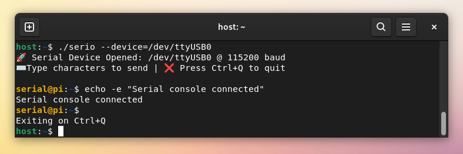

# Serial Communication

Cross-platform command-line utility for connecting to and interacting
with a device's serial console over a serial device.



## Build and execute

### Run locally

```sh
cargo run -- --device=/dev/ttyUSB0 --baudrate 115200
```

### Build release

```sh
cargo build --release
cargo build --target x86_64-pc-windows-gnu --release
```

### Use container

```sh
docker build -t rust-build ./container
docker run -v=$(pwd):/src -it rust-build bash
```
